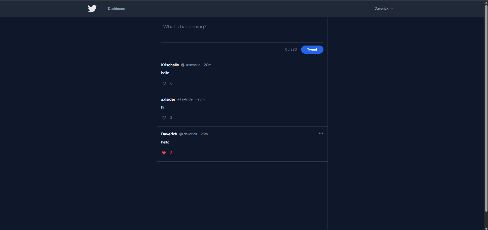
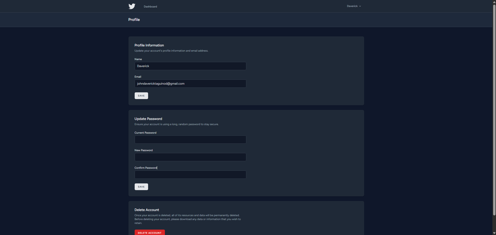
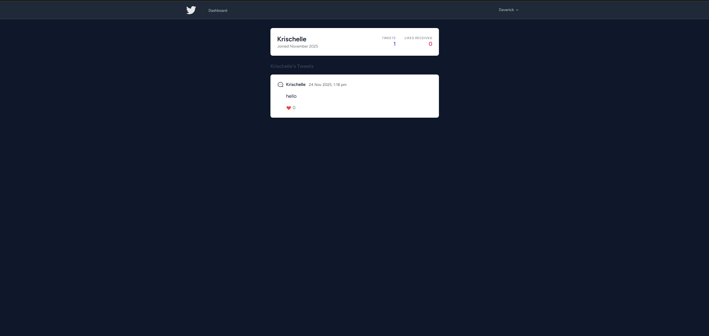
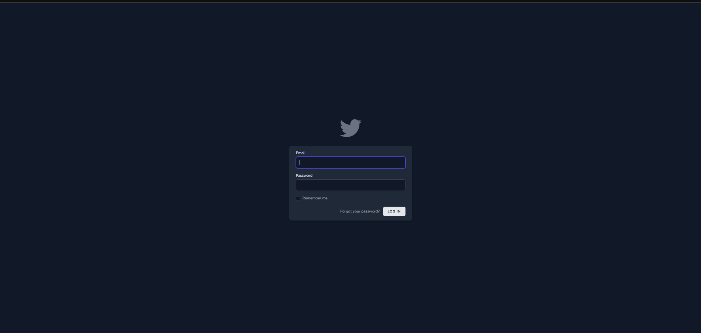
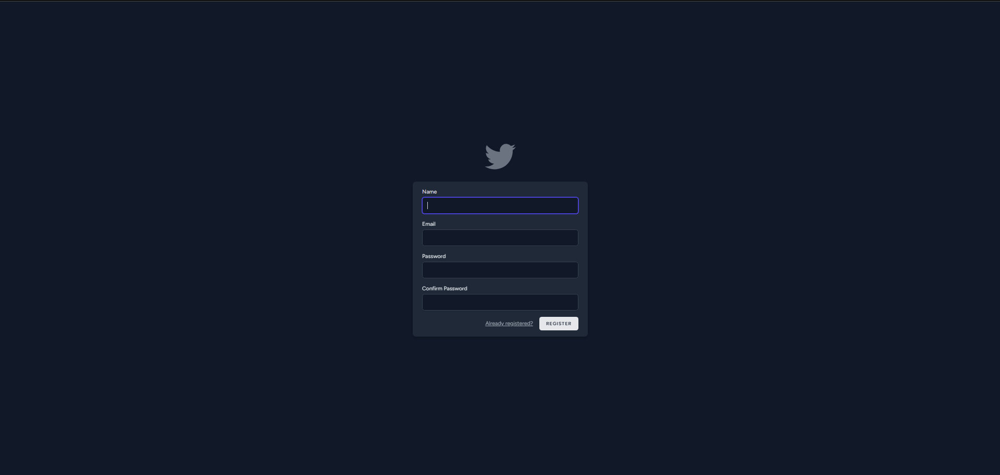
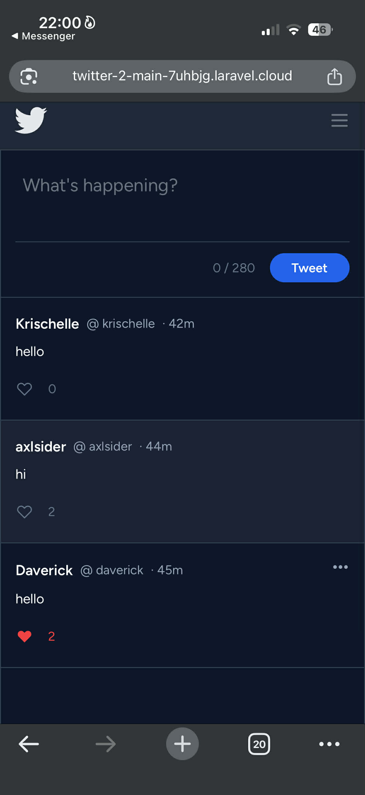
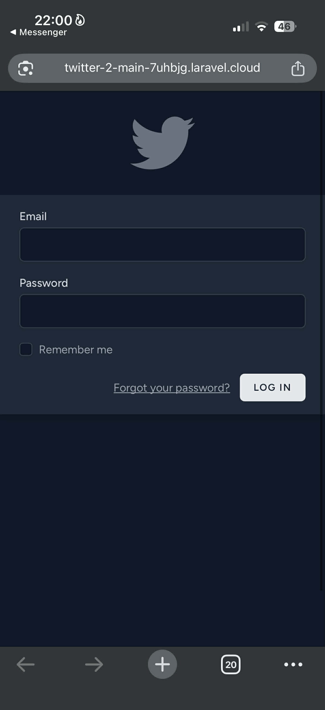
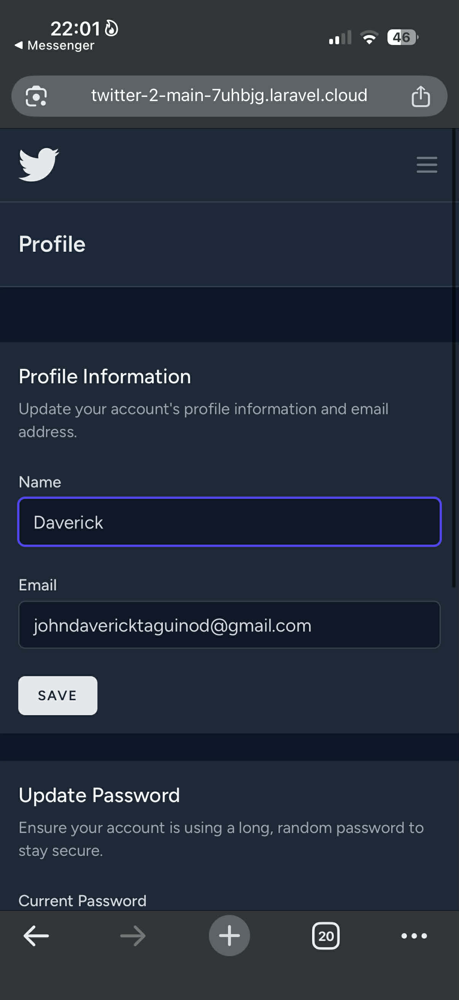

# D&K Twittrix

Welcome to **D&K Twittrix**, a social media micro-blogging application built with **Laravel 10**.

This project was developed to replicate the core experience of Twitter (X), focusing on a clean, "Lights Out" dark mode design and a seamless user experience. It allows users to register, share thoughts, interact with others via real-time likes, and manage their profiles.

## 🚀 Features Implemented

I focused on building a robust backend with a responsive, modern frontend. Here is what the app can do:

### 1. User Authentication
- **Secure Access:** Users can register and login securely using Laravel Breeze.
- **Security:** All passwords are hashed using Bcrypt.
- **Route Protection:** Unauthenticated users are redirected to login; only members can view the feed or interact.

### 2. Tweet Management (CRUD)
- **Posting:** Users can create tweets with a real-time character counter (max 280 characters).
- **Feed:** The homepage displays a global stream of tweets, ordered by newest first.
- **Editing:** Users can edit their own tweets (an "edited" tag appears to maintain transparency).
- **Deleting:** Users can delete their tweets, protected by a confirmation prompt to prevent accidents.

### 3. The Like System (AJAX)
- **Instant Feedback:** I implemented JavaScript (Fetch API) so that clicking the "Heart" icon updates the like count instantly without reloading the page.
- **Logic:** A user can toggle a like on or off, but cannot like the same tweet twice.

### 4. User Profiles
- **Personal Dashboard:** Clicking any username leads to their specific profile.
- **Stats:** Shows when they joined, how many tweets they have posted, and the total number of likes they have received.

### 5. UI/UX Design
- **"Lights Out" Theme:** A custom Dark Blue (`#0f172a`) theme designed for reduced eye strain.
- **Clean Layout:** Removed card borders in favor of a minimalist, line-separated feed similar to modern social platforms.
- **Responsive:** Built with Tailwind CSS to work perfectly on mobile and desktop.

---

## 🛠️ Installation Instructions

If you want to run this project on your local machine, follow these steps:

### Prerequisites
Ensure you have **PHP**, **Composer**, **Node.js**, and **MySQL** installed.

### Step 1: Clone & Install
bash
# Clone the repository
git clone [https://github.com/your-username/dk-twittrix.git](https://github.com/your-username/dk-twittrix.git)

# Enter the directory
option 1: cd dk-twittrix 
option 2: cd C:/xampp/htdocs/twitter

# Install PHP dependencies
composer install

# Install Frontend dependencies
npm install
npm run build

### Step 2: Environment Setup
# Create the environment file
cp .env.example .env

# Generate the app key
php artisan key:generate

### Step 3: Database Setup
DB_CONNECTION=mysql
DB_HOST=127.0.0.1
DB_PORT=3306
DB_DATABASE=twitter
DB_USERNAME=root
DB_PASSWORD=Step 3: Database Setup

### Step 4: Run Migrations
php artisan migrate

### Step 5: Launch
php artisan serve

## 📸 Application Screenshots

**1. The Feed (Dark Mode)**

**2. Profile Page & Stats**

**3. Tweets**

**4. login page**

**5. register page**

**6. Mobile Responsiveness**

### Credits & AI Tools Used

**Primary AI Tool:** Google Gemini

I utilized Google Gemini as an interactive pair programmer throughout the development lifecycle. Below is a detailed breakdown of how AI was used to assist in specific areas:

### 1. Database & Migration Troubleshooting
* **Conflict Resolution:** I encountered `SQLSTATE` errors because I had manually created tables in phpMyAdmin that conflicted with Laravel's migration files. Gemini provided the strategy to use `php artisan migrate:fresh` and the SQL commands (`SET FOREIGN_KEY_CHECKS=0`) to force-drop stubborn tables.
* **Schema Design:** Gemini assisted in defining the correct relationship syntax (e.g., `$table->foreignId('user_id')->constrained()`) to ensure the `tweets` and `likes` tables were properly linked to `users`.

### 2. Backend Logic Refactoring
* **AJAX Conversion:** Initially, the "Like" button used a standard HTML Form which caused the page to reload. I asked Gemini to refactor this into a JavaScript `fetch()` request. The AI provided the updated `TweetController` logic to return JSON responses instead of Redirects.
* **Authorization:** Gemini provided the code for `TweetPolicy` to ensure users could only Edit/Delete their own tweets using Laravel's `Gate` functionality.

### 3. UI/UX Design Iterations
* **The "Lights Out" Theme:** I wanted a specific dark-blue design similar to X (Twitter). Gemini generated the specific Hex color codes (`#0f172a` for background, `#1e293b` for headers) to achieve this look.
* **Debugging Invisible Text:** When switching to Dark Mode, the text remained white-on-white (invisible). Gemini diagnosed that Tailwind classes weren't compiling immediately and provided a fix using inline styles to force the contrast visibility.
* **Layout Adjustments:** The AI helped strip out the default "Card" borders to achieve the seamless, single-column feed layout I requested.

### 4. JavaScript Functionality
* **Character Counter:** Gemini generated the JavaScript logic to count characters in real-time and change the counter color to red when the user approaches the 280-character limit.